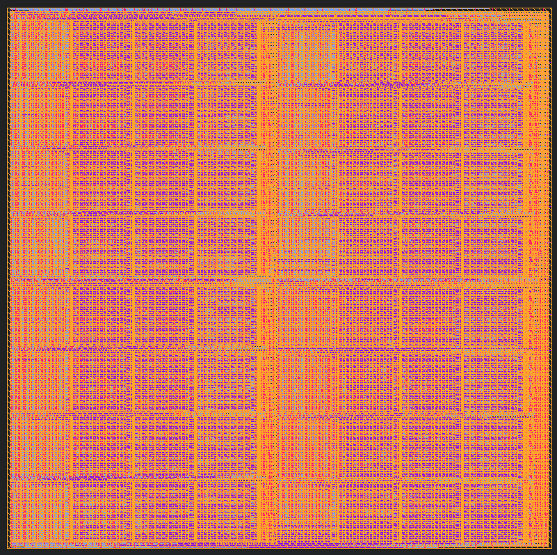

# DFFRAM Compiler
This is the custom placer for the SKY130A DFFRAM compiler. At the moment it is capable of placing the cells of DFFRAM 2048x32 block. A sample output is given below:

# Dependencies
You can use Docker to substitute all of these dependencies, but, in case of a native install:

* Python 3.8+ with PIP
  * PlaceRAM makes heavy use of `:=` and is unrepentant.
  * It might be repentant if we need to integrate it into Openlane or something.
* Opendbpy
  * Installation instructions can be found [here](./docs/md/Using%20Opendbpy.md).
* PIP package `click`: `pip3 install click`.

## Recommended
* Docker (see above)
* Klayout (to view the final result)

# Structure
* `docs/` contains documentation files. (😨)
* `sky130A/` contains PDK-specific files:
  * `BB/` contains a list of building blocks supported by the compiler.
* `placeram/` contains the core Python custom placer.
* `prflow.py` is the compilation flow going from building blocks to LVS.

# Documentation
[Table of Contents](./docs/Readme.md)
