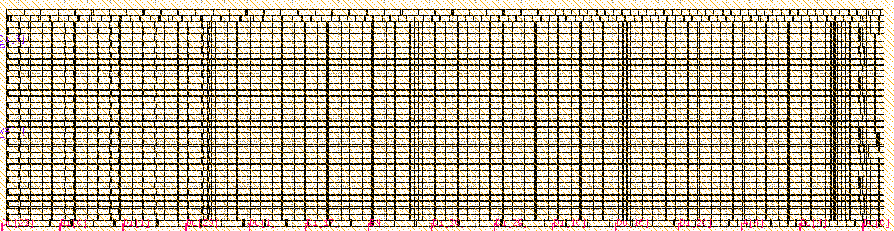
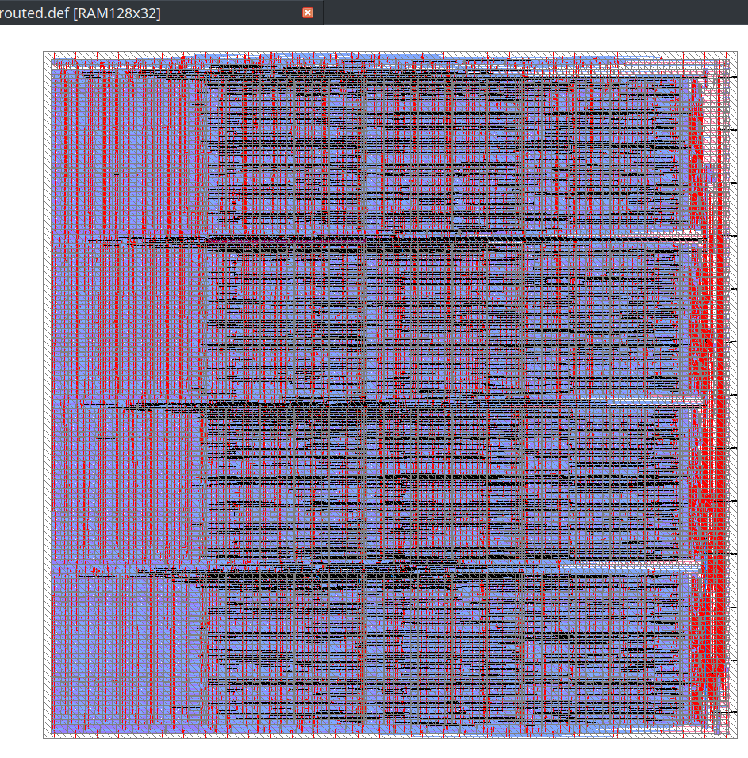

# PlaceRAM
This is the custom placer for the SKY130A DFFRAM compiler. At the moment it is capable pf placing the cells of DFFRAM 32x32 block. A sample output is given below:

Below is the Compiler-placed and openroad routed [RAM128x32 module](./BB.v)

 

# Dependencies
You can use Docker to substitute all of these dependencies, but:

* Python 3.8+ with PIP
  * PlaceRAM makes heavy use of `:=` and is unrepentant.
* Opendbpy
  * Installation instructions can be found [here](./docs/md/Using%20Opendbpy.md).
* PIP package `click`: `pip3 install click`.

## Recommended
* Docker (see above)
* Klayout (to view the final result)

# Structure
* `BB.v` contains the building blocks used by the compiler
* `example/` contains support files.
* `placeram/` contains the core Python script.
* `./prflow.py` is a flow going from building blocks to LVS.

# Documentation
1. [Using Opendbpy](./docs/md/Using%20Opendbpy.md)
2. [How PlaceRAM Works](./docs/md/How%20PlaceRAM%20Works.md)
