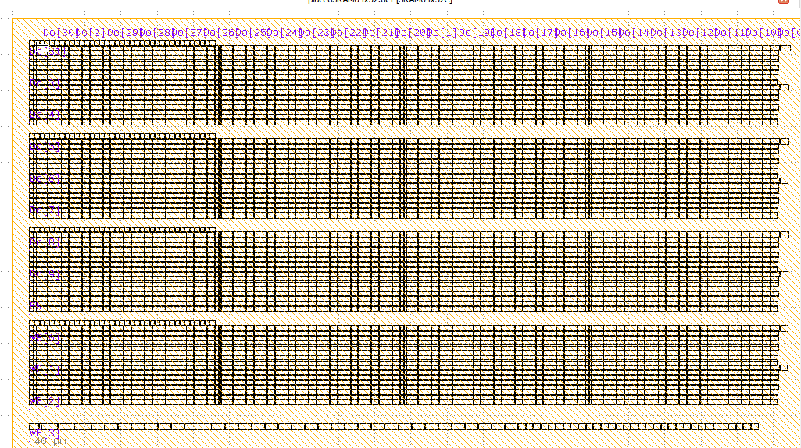

## Placement Script
This is the custom placer for the SKY130A DFFRAM compiler. At the moment it is capable pf placing the cells of DFFRAM 64x32 block. A sample output is given below:


## Dependancies
This script makes use of [OpenDB](https://github.com/The-OpenROAD-Project/OpenDB). It is a design database to support tools for physical chip design. You can visit their [github repository](https://github.com/The-OpenROAD-Project/OpenDB) for instructions regarding installation.

## Requirements to run the Script
In order to use the script, you have to have the following:
  1. A def file which contains all the intsances of the DFFRAM. This def file has to have am initialized floorplan, which has suffienct rows enough for placing all the instances.
  2. A technology LEF file, from which site dimensions will be extracted
  3. A macro LEF file, from which the differnet intsances will be extracted
  
## Running the script
To run the script use the following format:
```
python3 placeRAM.py -lef <lef_file_path> -tlech <tech_lef_file_path> -def <def_file_path>
```
This would produce a def file with the name: `placedSRAM64x32.def`, which would have all the instances placed.
