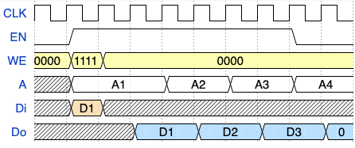
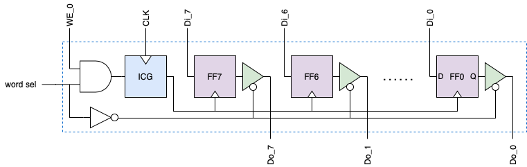
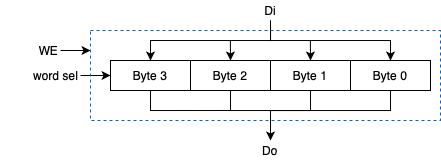
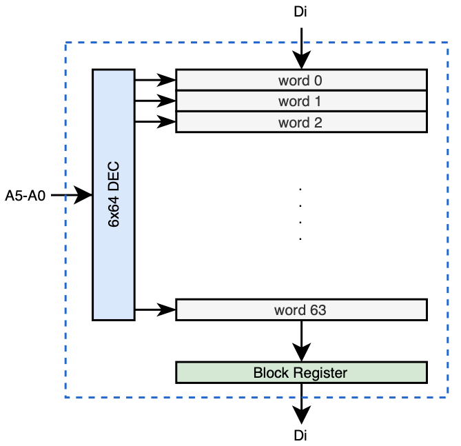
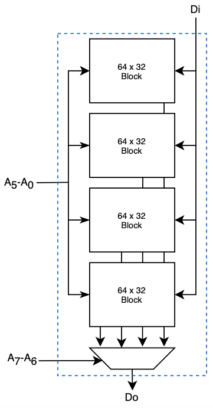

# DFFRAM Compiler
Standard Cell Library based Memory Compiler using DFF cells

The objective of this project is to develop DFF-based RAM and Register File (RegF) compiler that utilizes standard cell libraries following a standard ASIC implementation approach. The compiler generates different views (HDL netlist, HDL functional models, LEF, GDS, Timing, …) for a given configuration set. 

The layout generated from the compiler will be highly compacted (we target over 95% placement density) as the cells are placed on the floor plan using a custom placer. Moreover, the custom placer ensures that the routing will be a seamless one. The project will consider the creation of a custom router if automatic routing using open-source global and detailed routers does not give good results. 

Currenly, the repo has only a handcrafted parameterized memory (1, 2 or 4 kbytes) targeting the SKY130 PDK. Also, it contains all the building blocks and a self-checking testbench. 

## Handcrafted Memory
Two modules (single RW port RAM) are provided:
- [DFFRAM](https://github.com/shalan/DFFRAM/blob/ec4cad3cc4d421492ec9dbf9eb5d70b53d24aa03/Handcrafted/Models/DFFRAM.v#L1 "DFFRAM"): parameterized 1 (256x32), 2 (512x32) or 4 (1024x32) kbytes memory module.
- [DFFRAM_256x32](https://github.com/shalan/DFFRAM/blob/ec4cad3cc4d421492ec9dbf9eb5d70b53d24aa03/Handcrafted/Models/DFFRAM_256x32.v#L1 "DFFRAM_256x32"): 1kbyte memory module
- [RAM_4Kx32] () 16Kbytes memory
- [RAM_5Kx32] () 20Kbytes memory

### Memory Interface
| Port  | Direction  | Size  | Function |
| ------------ | ------------ | ------------ |------------ |
| CLK | input  | 1  | Clock (positive edge triggered) |
| EN  | input | 1 | Memory enable. Do is 0 when memory is disabled |
| WE | input  |  4 | Write enable (byte level) |
| A | input  | 8, 9, 10  | Address lines |
| Di  | input  | 32  | Data in |
| Do  | output  | 32  | Data out |

The following waveform diagram shows memory write and read transactions. 

To perform a memory write, the memory has to be enabled (`EN=1`), `WE` must be set to reflect the bytes to be written, `A` has the address of the word that contains the bytes to be written and `Di` has the data  to be written. The write will rake place with the positive edge of the clock. To read from the memory, the memory has to be enabled, `WE` lines must be cleared and `A` has the memory address. The read word will be available on the `Do` lines immediately after the positive edge of the clock.

*Note: Do lines are set to 0s when EN=0*

### Simulating the Memory
This [file](https://github.com/shalan/DFFRAM/blob/ec4cad3cc4d421492ec9dbf9eb5d70b53d24aa03/Handcrafted/Verification/tb_DFFRAM.v#L1 "file") contains a self checking testbench that can be simulated using [Icarus Verilog](https://iverilog.fandom.com/wiki/Main_Page). Also, it contains a [behavioral model ](https://github.com/shalan/DFFRAM/blob/ec4cad3cc4d421492ec9dbf9eb5d70b53d24aa03/Handcrafted/Verification/tb_DFFRAM.v#L50-L60) for the memory. 

To run the simulation, you need to have the SKY130 open PDK installed. A [makefile](https://github.com/shalan/DFFRAM/blob/97f1ade330a06a4fc2ffbabe576d7cff9f222448/Handcrafted/Verification/Makefile#L1 "makefile") is provided to run the simulation.

### Hardening the Memory
Untill the compiler is ready, you may use [OpenLANE](https://github.com/efabless/openlane "OpenLANE") to harden the memory. Make sure that the flow configuration parameter `SYNTH_READ_BLACKBOX_LIB` is set to 1. A smaple OpenLANE design configuration file can be found [here](https://github.com/shalan/DFFRAM/blob/22d62832ef3b4b1d53bcfc8cb2460ff20d21449f/Handcrafted/OpenLANE/config.tcl#L1 "here").

The following table compares the hardened handcrafted memories to the equivalent hardened RTL synthesized memories. Both hardened using OpenLANE.

|  Memory Type | No. of Instances  |  Placement Density | Dimensions X (um) x Y (um)
| ------------ | ------------ | ------------ |------------ |
| HC 1 kbyte  |  19,897 | 87.2%  | 425	x 820|
| HC 2 kbytes  |  40,554 | 84.8%  |1,210 x 610|
| HC 4 kbytes  | 81,044  | 84.8%  | 1,628 x 911|
| RTL 1 kbyte  |  51,972 | 61%  | 1,050 x 1,060|
| RTL 2 kbytes*  |  103,933 | 61%  |1,470 x 1,481|
| RTL 4 kbytes  | 207,822 | 61%  | 2,074 x 2,085|

`*` OpenLANE did not produce a clean GDSII

We target above 95% placement density using the DDFRAM compiler custom placer. 

### Building Blocks
#### Byte

#### Word

#### Block (32x64)

#### Column (1 kbytes)

## Handcrafted Register File (32x32)
A 32x32 register file with two r/w ports and one write port can be found [here](https://github.com/shalan/DFFRAM/blob/3cc619ff1f49cdf8ee3414688eb096bd9cca4e30/Handcrafted/Models/DFFRFile.v#L1).
This register file uses clock gating. Comparing it to the synthesized and mapped RTL model, the DFFRFile consumes very little power (to be quantified) and has less number of instances (~50%).

## Handcrafted Direct Mapped Cache (512 bytes: 32 lines x 16 bytes)
Can be found [here](https://github.com/shalan/DFFRAM/blob/3cc619ff1f49cdf8ee3414688eb096bd9cca4e30/Handcrafted/Models/DMC_32x16HC.v#L1). 

