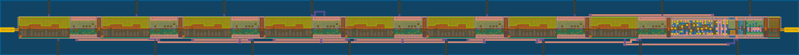
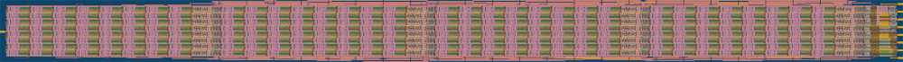
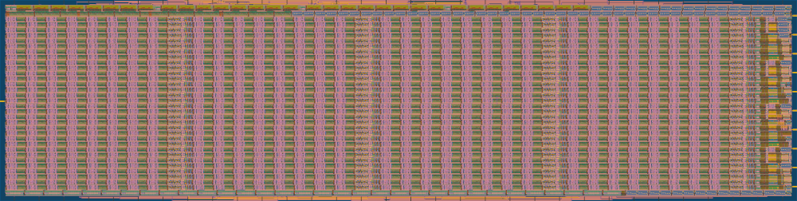

<h1 align="center"> DFFRAM Compiler</h1>
<p align="center">
  <a href="https://colab.research.google.com/github/Cloud-V/DFFRAM/blob/main/dffram.ipynb"></a>
</p>
<p align="center">
    <a href="https://opensource.org/licenses/Apache-2.0"></a>
    
    <a href="https://invite.skywater.tools"></a>
    <a href="https://github.com/psf/black"></a>
</p>

Standard Cell Library based Memory Compiler using DFF/Latch cells.

# ✨ Quick Usage
You can try the [Google Colaboratory](https://colab.research.google.com/github/Cloud-V/DFFRAM/blob/main/dffram.ipynb), but also...

[Get **Docker**](https://docs.docker.com/get-docker/), set it up nicely, then, in your terminal:

```sh
pip3 install --user --no-cache-dir --upgrade ./requirements.txt
./dffram.py -s 32x32
```

If all goes well, you've placed your first register file!

# Overview
The objective of this project is to develop a DFF/Latch-based RAM, Register File and Cache custom compilation flow that utilizes standard cell libraries following a standard ASIC (Application Specific Integrated Circuit) implementation approach. Different views (HDL netlist, HDL functional models, LEF, GDS, Timing, …) are all generated for a given size configuration.

The layout targets highly compact designs (85%+) as the cells are placed on the floor plan using a custom placer. Moreover, the custom placer ensures that the routing will be relatively simple. Currently, the compiler uses OpenROAD routers to route the macros with great success. 

The Compiler relies on basic building blocks to construct the layout of different RAM/RF/Cache configurations. Check [the compiler documentation](./docs/) for more info. The following shows how a 32x32 memory (DFF based) is constructed.


The generated layouts by the DFFRAM compilers for RAM32 as well as its building blocks are as follows:
- First, a byte, which is just 8 bits placed together...


- Put four of those side by side, and you get a 32-bit word...


- Stack eight of those for an 8 word bank of RAM...


- And stack 4 of these 8 words for a kilobit of RAM!


- We can keep going, but these images aren't getting any smaller. As a bonus though, here is 64 kilobits:


> That stuff you see on the right of each image? It's clock gates, decoders and the like. Don't worry about it.


Currently, the can compiler generate the layout of the following configurations:

> 1RW1R variants are temporarily disabled due to a bug.

- RAM
  - 32 words with byte write enable (1RW and 1RW1R).
  - 128 words with byte write enable (1RW and 1RW1R).
  - 256 words with byte write enable (1RW and 1RW1R).
  - 512 words with byte write enable (1RW and 1RW1R).
  - 1024 words with byte write enable (1RW and 1RW1R).
  - 2048 words with byte write enable (1RW and 1RW1R).
- Register File
  - 32 x 32-bit words (2R1W)

The [`OpenLane/`](./OpenLane) folder will contain good known OpenLane configurations to build DFFRAM different macros. 
 
## File Structure
* `.github` contains files for GitHub actions.
* `docs/` contains documentation (😮)
* `rtl/` contains RTL RAM file generators for benchmarking and comparison purposes.
* `platforms/` contains PDK-specific files:
  * `<pdk-name>/`
    * `<scl-name>/`
      * `_building_blocks/` contains a hierarchy of building blocks supported by the compiler.
* `placeram/` is the custom placer Python module.
* `scripts/` has assisting scripts used by the flow.
* `dffram.py` is the compilation flow going from building blocks to LVS.

# Comparisons
The following table compares the areas and bit densities of RAM macros generated using different means.


<table>
  <tr>
    <th rowspan="2">Size<sup>1</sup></th> 
    <th colspan="2">OpenRAM<sup>2</sup></th> 
    <th colspan="2">DFFRAM Compiler</th> 
    <th colspan="2">DFFRAM/OpenLane</th> 
    <th colspan="2">RTL/OpenLane</th>
  </tr>
  <tr style="border-top:4px solid darkblue;">
    <td> Dim WxH (μm) </td> <td> Bit Density (bits/mm<sup>2</sup>) </td>
    <td> Dim WxH (μm) </td> <td> Bit Density (bits/mm<sup>2</sup>) </td>
    <td> Dim WxH (μm) </td> <td> Bit Density (bits/mm<sup>2</sup>) </td>
    <td> Dim WxH (μm) </td> <td> Bit Density (bits/mm<sup>2</sup>) </td>
  </tr>
  <tr>
    <td> 512 bytes </td>
    <td> N/A </td> <td> N/A </td>
    <td> 396.52 x 388.96 </td> <td> 26,557 </td>
    <td> 527.46 x 527.46 </td> <td> 14,722 </td>
    <td> 680.25 x 690.97 </td> <td> 8,714 </td>
  </tr>
  <tr>
    <td> 1 kbytes </td>
    <td> 386 x 456 </td> <td> 46,541 </td>
    <td> 792.58  x 397.12 <td> 26,027 </td>
    <td> 975.01 x 985.73 </td> <td> 8,523 </td>
    <td> 1,050 x 1,060 </td> <td> 7,360 </td>
  </tr>
  <tr>
    <td> 2 kbytes </td>
    <td> 659.98 x 398.18  </td> <td> 62,372 </td>
    <td> 792.58 x 786.08 </td> <td> 26,297 </td>
    <td> 1374.46 x 1385.18 </td> <td> 8,605 </td>
    <td> 1,439.615 x 1,450.335 </td> <td> 7,847 </td>
  </tr>
  <tr>
    <td> 4 kbytes </td>
    <td> 670.86 x 651.14 </td> <td> 75,014 </td>
    <td> 1,584.24 x 788.8 </td> <td> 26,196 </td>
    <td> 1940.45 x 1951.17 </td> <td> 8,654 </td>
    <td> 2,074 x 2,085 </td> <td> 7,578 </td>
    
  </tr>
  <tr>
    <td> 8 kbytes </td>
    <td> N/A </td> <td> N/A </td>
    <td> 1,589 x 1,572</td> <td> 26,229 </td>
    <td> TBD </td> <td> TBD </td>
    <td> 2,686.610 x 2,697.330 </td> <td> 9,043 </td>
  </tr>
</table>


<sup>1</sup> All support 32-bit word reads and 1, 2, and 4 bytes writes.  
<sup>2</sup> Values are based on the original layout produced by the compiler. OpenRAM macros are typically wrapped to be useful w/ automated PnR ASIC flows.

# ⚖️ Copyright and Licensing
<a id="copyright-and-licensing"></a>
Copyright ©2020-2022 The American University in Cairo

Licensed under the Apache License, Version 2.0 (the "Open Source License");
you may not use this file except in compliance with the Open Source License.
You may obtain a copy of the Open Source License at the root of this repository
(see the file 'License') or at

> http://www.apache.org/licenses/LICENSE-2.0

Unless required by applicable law or agreed to in writing, software
distributed under the Open Source License is distributed on an "AS IS" BASIS,
WITHOUT WARRANTIES OR CONDITIONS OF ANY KIND, either express or implied.
See the Open Source License for the specific language governing permissions and
limitations under the Open Source License.
