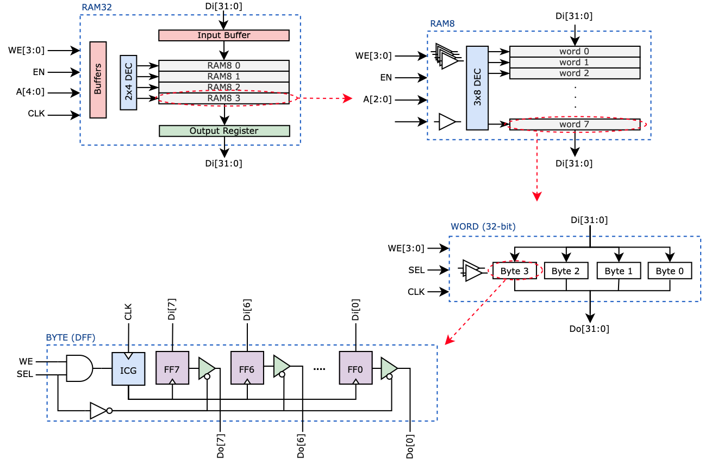
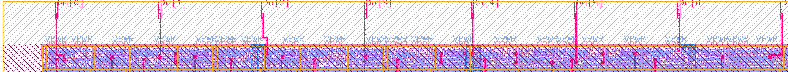
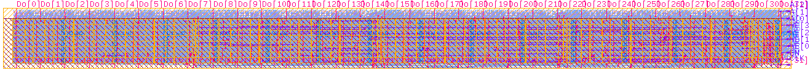
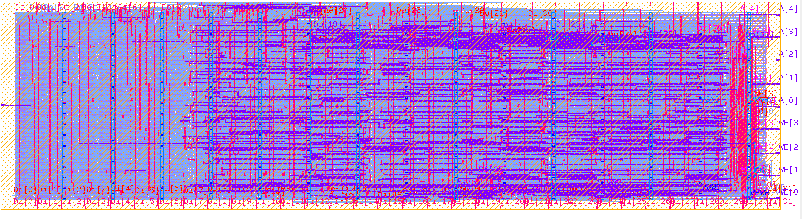
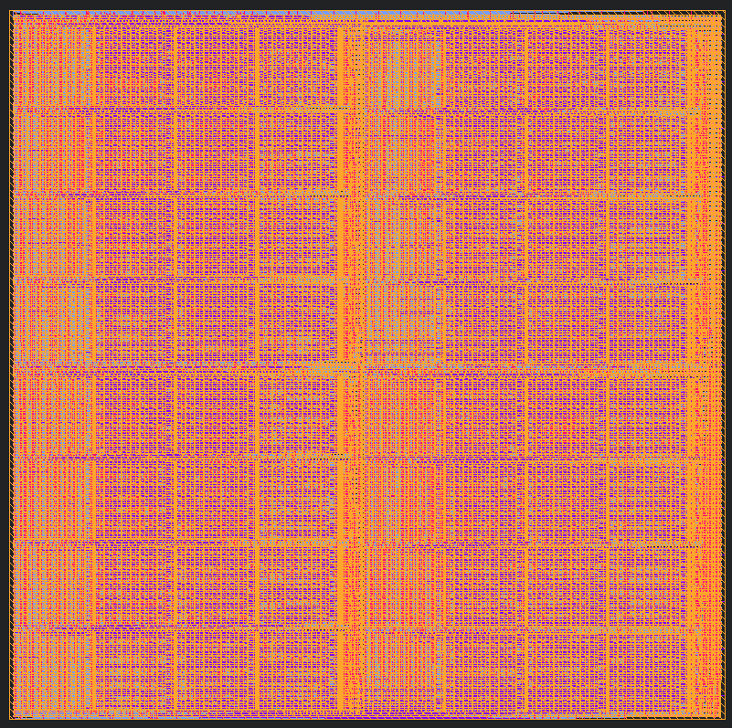

# DFFRAM Compiler

Standard Cell Library based Memory Compiler using DFF/Latch cells.

# Table of Content
- [Overview](#overview)
- [Comparisons](#comparisons)
- [Compiler Details](./docs/Compiler.md)
- [DFFRAM Macros Interface Specifications](./docs/md/Specs.md)
- [Copyright and Licensing](#️-copyright-and-licensing)

# Overview
The objective of this project is to develop a DFF/Latch-based RAM, Register File and Cache custom compilation flow that utilizes standard cell libraries following a standard ASIC (Application Specific Integrated Circuit) implementation approach. Different views (HDL netlist, HDL functional models, LEF, GDS, Timing, …) are all generated for a given size configuration.

The layout generated from the compiler is highly compact (95%+ placement density) as the cells are placed on the floor plan using a custom placer. Moreover, the custom placer ensures that the routing will be relatively simple. Currently, the compiler uses OpenROAD routers to route the macros with great success. 

*Note: The project will consider the creation of a custom router if automatic routing using open-source global and detailed routers do not give good results, though, they are, so far.*

The Compiler relies on basic building blocks to construct the layout of different RAM/RF/Cache configurations. Check [the compiler documentation](./docs/Compiler.md) for more info. The following shows how a 32x32 memory (DFF based) is constructed.

The generated layouts by the DFFRAM compilers for RAM32 as well as its building blocks are as follows:
- BYTE

&nbsp;&nbsp;&nbsp;&nbsp;&nbsp;&nbsp;&nbsp;&nbsp;&nbsp;&nbsp;&nbsp; 
- WORD (32-bit)

- RAM8 (32x8)

- RAM32 (32x32)

Currently, the can compiler generate the layout of the following configurations:
- RAM
  - 32 words with byte write enable (1RW and 1RW1R).
  - 128 words with byte write enable (1RW and 1RW1R).
  - 256 words with byte write enable (1RW and 1RW1R).
  - 512 words with byte write enable (1RW).
  - 1024 words with byte write enable (1RW).
  - 2048 words with byte write enable (1RW).
- Register File
  - 32x32 (2R1W)

The layout of 2048x32 (8 Kbytes) RAM as generated by the compiler is shown below:

The [`OpenLane/`](./OpenLane) folder will contain good known OpenLane configurations to build DFFRAM different macros. 
 
# Comparisons
The following table compares the areas and bit densities of RAM macros generated using different means.

<table>
  <tr>
    <th rowspan="2">Size1</th> 
    <th colspan="2">OpenRAM2</th> 
    <th colspan="2">DFFRAM Compiler</th> 
    <th colspan="2">DFFRAM/OpenLane</th> 
    <th colspan="2">RTL/OpenLane</th>
  </tr>
  <tr style="border-top:4px solid darkblue;">
    <td> Dim WxH (μm) </td> <td> Bit Density (bits/mm2) </td>
    <td> Dim WxH (μm) </td> <td> Bit Density (bits/mm2) </td>
    <td> Dim WxH (μm) </td> <td> Bit Density (bits/mm2) </td>
    <td> Dim WxH (μm) </td> <td> Bit Density (bits/mm2) </td>
  </tr>
  <tr>
    <td> 512 bytes </td>
    <td> N/A </td> <td> N/A </td>
    <td> 395.6 x 388.96 </td> <td> 26,619 </td>
    <td> TBD </td> <td> TBD </td>
    <td> 680.25 x 690.97 </td> <td> 8,714 </td>
  </tr>
  <tr>
    <td> 1 kbytes </td>
    <td> 386 x 456 </td> <td> 46,541 </td>
    <td> 788.44 x 394.4 <td> 26,344 </td>
    <td> TBD </td> <td> TBD </td>
    <td> 1,050 x 1,060 </td> <td> 7,360 </td>
  </tr>
  <tr>
    <td> 2 kbytes </td>
    <td> 659.98 x 398.18  </td> <td> 62,372 </td>
    <td> 793.5 x 783.36 </td> <td> 26,358 </td>
    <td> TBD </td> <td> TBD </td>
    <td> 1,439.615 x 1,450.335 </td> <td> 7,847 </td>
  </tr>
  <tr>
    <td> 4 kbytes </td>
    <td> 670.86 x 651.14 </td> <td> 75,014 </td>
    <td> 1,584.24 x 788.8 </td> <td> 26,196 </td>
    <td> TBD </td> <td> TBD </td>
    <td> 2,074 x 2,085 </td> <td> 7,578 </td>
    
  </tr>
  <tr>
    <td> 8 kbytes </td>
    <td> N/A </td> <td> N/A </td>
    <td> 1,589 x 1,572</td> <td> 26,229 </td>
    <td> TBD </td> <td> TBD </td>
    <td> 2,686.610 x 2,697.330 </td> <td> 9,043 </td>
  </tr>
</table>

1 All support 32-bit word reads and 1, 2, and 4 bytes writes.  
2 Values are based on the original layout produced by the compiler. OpenRAM macros are typically wrapped to be useful w/ automated PnR ASIC flows.

For more about the Handcrafted models, check the [Handcrafted Readme](./Handcrafted/docs/Readme.md).

# Usage
Check [Using Prflow](./Compiler/docs/md/Using%20Prflow.md).

# ⚖️ Copyright and Licensing
Copyright ©2020-2021 The American University in Cairo and the Cloud V Project.

Licensed under the Apache License, Version 2.0 (the "Open Source License");
you may not use this file except in compliance with the Open Source License.
You may obtain a copy of the Open Source License at the root of this repository
(see the file 'License') or at

> http://www.apache.org/licenses/LICENSE-2.0

Unless required by applicable law or agreed to in writing, software
distributed under the Open Source License is distributed on an "AS IS" BASIS,
WITHOUT WARRANTIES OR CONDITIONS OF ANY KIND, either express or implied.
See the Open Source License for the specific language governing permissions and
limitations under the Open Source License.
