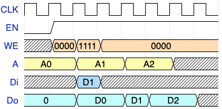
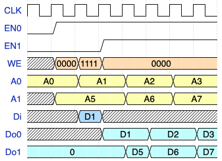
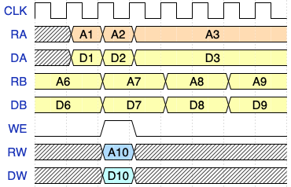

# Macros Interface Specifications
## RAM (1RW) Interface
| Port  | Direction  | Size  | Function |
| ------------ | ------------ | ------------ |------------ |
| CLK | input  | 1  | Clock (positive edge triggered) |
| EN  | input | 1 | Memory enable. Do is 0 when memory is disabled |
| WE | input  |  4 | Write enable (byte level) |
| A | input  | `log2(# of words)` | Address lines |
| Di  | input  | 32  | Data in |
| Do  | output  | 32  | Data out |

The following waveform diagram shows memory write and read transactions. 

To perform a memory write, the memory has to be enabled (`EN=1`), `WE` must be set to reflect the bytes to be written, `A` has the address of the word that contains the bytes to be written and `Di` has the data  to be written. The write will rake place with the positive edge of the clock. To read from the memory, the memory has to be enabled, `WE` lines must be cleared and `A` has the memory address. The read word will be available on the `Do` lines immediately after the positive edge of the clock.

## RAM (1RW1R) Interface
| Port  | Direction  | Size  | Function |
| ------------ | ------------ | ------------ |------------ |
| CLK | input  | 1  | Clock (positive edge triggered) |
| WE | input  |  4 | Write enable (byte level) |
| Di  | input  | 32  | Data in (Port 0) |
| EN0  | input | 1 | Memory enable. Do is 0 when memory is disabled (port 0)|
| EN1  | input | 1 | Memory enable. Do is 0 when memory is disabled (port 1)|
| A0 | input  | `log2(# of words)`  | Address lines (port 0) |
| A1 | input  | `log2(# of words)` | Address lines (port 1)|
| Do0  | output  | 32  | Data out (port 0)|
| Do1  | output  | 32  | Data out (port 1)|

## Register File (2R1W) Interface
| Port  | Direction  | Size  | Function |
| ------------ | ------------ | ------------ |------------ |
| CLK | input  | 1  | Clock (positive edge triggered) |
| WE | input  |  1 | Write enable  |
| RA  | input  | 5  | Register number for read port A |
| RB  | input  | 5  | Register number for read port B |
| RB  | input  | 5  | Register number for write port W |
| DA  | output  | 32  | Data out (port A)|
| DB  | output  | 32  | Data out (port B)|
| DW  | input  | 32  | Data in (port W)|

	

*Note: The timing diagrams are created using wavedrom using this [file](../img/ifc.json).*