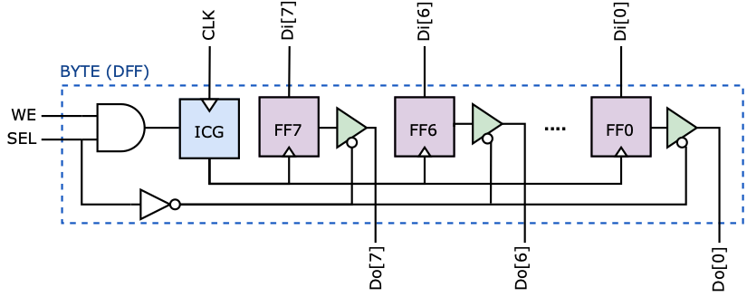
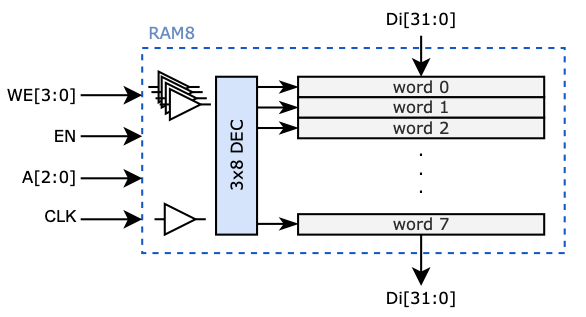
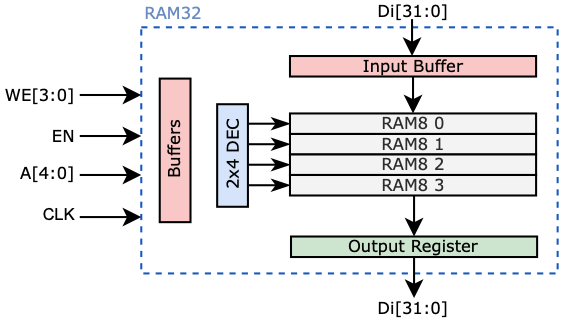

# Building Blocks
## RAM Building Blocks
- Byte

<<<<<<< HEAD
&nbsp;&nbsp;&nbsp;&nbsp;&nbsp;&nbsp;&nbsp;&nbsp;&nbsp;&nbsp;&nbsp; 

- Word

&nbsp;&nbsp;&nbsp;&nbsp;&nbsp;&nbsp;&nbsp;&nbsp;&nbsp;&nbsp;&nbsp; 

- RAM8 (8 words with tri-state output)

&nbsp;&nbsp;&nbsp;&nbsp;&nbsp;&nbsp;&nbsp;&nbsp;&nbsp;&nbsp;&nbsp; 

- Word32 (32 )words with registered output

&nbsp;&nbsp;&nbsp;&nbsp;&nbsp;&nbsp;&nbsp;&nbsp;&nbsp;&nbsp;&nbsp; 
=======
 

- Word

 

- RAM8 (8 words with tri-state output)

 

- Word32 (32 )words with registered output

 
>>>>>>> Updated the documentation

## RF Building Blocks